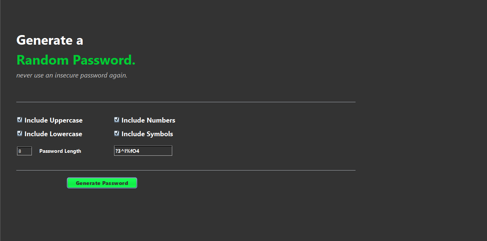

# 🔐 Random Password Generator

A simple Java application that generates strong, secure random passwords based on user-defined preferences. The tool supports a variety of character sets including uppercase letters, lowercase letters, numbers, and special characters.

---

## ⚙️ Features

- Generate passwords of custom length
- Supports uppercase, lowercase, digits, and special characters
- Easy to use and extend
- GUI support 

---

## 🖥️ Output Screenshot

Here’s an example of the application output:




## 🚀 How to Run

### ✅ Requirements

- Java 17 or above
- Maven (if using Maven project)

### 🔧 Using Command Line (Maven)

```bash
mvn clean compile
mvn exec:java -Dexec.mainClass="your.package.MainClass"
